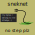

# sneknet
Work in progress replacement for PDANet, written in golang and java

## implemented
- mono-repo for sneknet_host (golang), sneknet_android (java), sneknet_proto (protobufs)
- static IP for virtual network on host: 10.0.0.1
- static IP for sneknet as a router/default gateway: 10.0.0.2
- ARP Request for gateway handled appropriately
- linux based OS now routes traffic via sneknet_host on startup

## todo
- reroute tcp via ADB to android / packet data source IP rewrite
- udp
- android bridge as UDP using hacks, plus fallback to TCP
